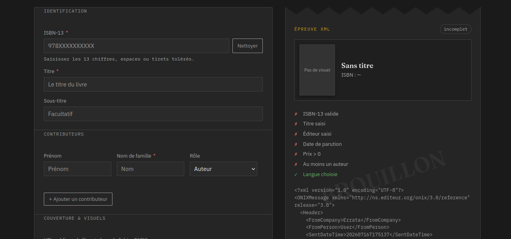

# <span style="color:#D4A017">E</span>rrat<span style="color:#D4A017">a</span> — Générateur ONIX 3.0 simplifié

<div align="center">
  
  <h3><strong><span style="color:#D4A017">E</span>rrat<span style="color:#D4A017">a</span></strong></h3>
  <p><strong>Un code au service de la création culturelle et de la bibliodiversité.</strong></p>

  
  
  [](https://ax4m3.github.io/Errata/)
  
  
  
</div>

---
**Errata** est un outil en ligne léger et open-source conçu pour aider les éditeurs indépendants et auto-édités à générer facilement leurs fiches de métadonnées de livres au format standard international **ONIX 3.0**. 

Il élimine la complexité de la manipulation directe des fichiers XML structurés en proposant un formulaire de saisie guidé.

**[Tester l'outil en direct sur GitHub Pages](https://ax4m3.github.io/Errata/)**

## Fonctionnalités clés

* **Formulaire guidé :** Saisie intuitive des informations indispensables de la chaîne du livre (Titre, ISBN, Prix, Contributeurs...).
* **Aperçu en temps réel :** Visualisez instantanément la structure du code XML généré sur le panneau latéral (ou en bas de page sur mobile).
* **Classification Thema :** Intégration d'un mini-navigateur de catégories Thema (liste étendue synchronisée) pour enrichir le champ *Subject*.
* **Actions rapides :** Copie du code XML en un clic dans le presse-papiers ou téléchargement direct du fichier `.xml` nommé d'après votre ISBN.
* **Souveraineté et sécurité totale :** Application purement statique (*Client-Side*). Vos données ne quittent **jamais** votre ordinateur et aucun serveur n'intervient. L'outil fonctionne même 100% hors-ligne.

## Technologies
* **Front-end :** HTML, JavaScript, CSS.
* **Architecture :** Application 100% statique (Client-side) garantissant une confidentialité totale.

## Comment l'utiliser ?

1. Rendez-vous sur [Errata en ligne](https://ax4m3.github.io/Errata/).
2. Remplissez les métadonnées de votre livre. Les champs obligatoires pour le bon traitement par les réseaux de distribution sont marqués d'un **astérisque rouge (<span style="color:#ff6b6b">*</span>)**.
3. Vérifiez la validité de vos données grâce à l'aperçu dynamique.
4. Cliquez sur **Télécharger le .xml** ou **Copier le XML**.
5. Déposez ou transmettez simplement ce fichier sur les espaces professionnels de vos partenaires (Dilicom, Electre, distributeurs, etc.).

> ⚠️ **Attention :** Cet outil produit un squelette structurellement correct pour les cas de figures courants de l'édition. Il n'effectue pas de validation par schéma XSD complet et sa liste de genres est synthétique. Pensez à valider vos codes auprès des instances officielles de l'[EDItEUR](https://www.editeur.org/) avant vos envois de production.

> **Vérification :**  Vous pouvez aussi vérifier le fichier en déposant/collant le texte sur l'outil [XLM validation](https://www.xmlvalidation.com/). *Pour l'instant toutes fiches créées avec Errata ont été validées.*

## Aperçu de l'outil

### Voici un apperçu de la page


## Exemple de sortie (XML)
Voici un extrait de la structure ONIX 3.0 générée par l'outil - <stong>Version Errata 1.9.0</strong>:

<details>
<summary><strong>Exemple avec l'ouvrage <em>« État de droit », ordre bourgeois</em> par Esla Marcel aux éditions La fabrique</strong></summary>
```
<?xml version="1.0" encoding="UTF-8"?>
<ONIXMessage xmlns="http://ns.editeur.org/onix/3.0/reference" release="3.0">
  <Header>
    <FromCompany>Errata</FromCompany>
    <SentDateTime>20260716191812Z</SentDateTime>
  </Header>
  <Product recordReference="REF-9782358723138">
    <RecordReference>REF-9782358723138</RecordReference>
    <NotificationType>02</NotificationType>
    <ProductIdentifier>
      <ProductIDType>15</ProductIDType>
      <IDValue>9782358723138</IDValue>
    </ProductIdentifier>
    <DescriptiveDetail>
      <ProductComposition>10</ProductComposition>
      <ProductForm>BC</ProductForm>
      
      
      
      <Language><LanguageRole>01</LanguageRole><LanguageCode>fre</LanguageCode></Language>
      <TitleDetail>
        <TitleType>01</TitleType>
        <TitleElement>
          <TitleElementLevel>01</TitleElementLevel>
          <TitleText>« État de droit », ordre bourgeois</TitleText>
          <Subtitle>Renouer avec la défense politique</Subtitle>
        </TitleElement>
      </TitleDetail>
            <Contributor>
        <SequenceNumber>1</SequenceNumber>
        <ContributorRole>A01</ContributorRole>
        <NamesBeforeKey>Elsa</NamesBeforeKey>
        <KeyNames>Marcel</KeyNames>
      </Contributor>
      
    </DescriptiveDetail>
    <CollateralDetail>
      <TextContent>
        <TextTypeCode>03</TextTypeCode>
        <ContentAudience>00</ContentAudience>
        <Text>Face aux gouvernements liberticides, aux violences policières, à la réaction coloniale en Kanaky ou au patronat radicalisé, plus il devient nécessaire de se défendre en justice, plus il est difficile de le faire. C’est l’expérience que font au quotidien les avocat-es des classes opprimées : quand l’ordre social et la légitimité du pouvoir sont mis en cause, garde des Sceaux, parquet et juges font bloc derrière le régime, et les principes libéraux de« l’État de droit »ne pèsent plus bien lourd. Pour conjurer l’impuissance, Elsa Marcel invite à renouer avec la défense politique déployée par les avocat-es s des combattant-es du FLN pendant la guerre d’Algérie, par les grandes figures du mouvement ouvrier comme Marx ou Rosa Luxemburg lors de leurs procès, par les animateurs du Tribunal Russell contre les crimes américains au Vietnam ou encore par les juristes du Mouvement d’action judiciaire dans les années 1970 – autant de pistes pour repenser aujourd’hui les pratiques de la profession et ses rapports aux luttes.

Une analyse lucide de l’arène judiciaire sous état d’urgence pour servir au combat dans les tribunaux comme en dehors.</Text>
      </TextContent>
      <SupportingResource>
        <ResourceContentType>01</ResourceContentType>
        <ResourceMode>03</ResourceMode>
        <ResourceLink>https://lafabrique.fr/wp-content/uploads/2025/11/FAB_13x20_MARCEL_Ordre-665x1024.jpg</ResourceLink>
      </SupportingResource>
    </CollateralDetail>
    <PublishingDetail>
      <Imprint>
        <ImprintName>La fabrique éditions</ImprintName>
        <ImprintIdentifier>
          <ImprintIDType>01</ImprintIDType>
          <IDValue>La fabrique éditions</IDValue>
        </ImprintIdentifier>
      </Imprint>
      
      <Publisher>
        <PublishingRole>01</PublishingRole>
        <PublisherName>La fabrique éditions</PublisherName>
      </Publisher>
            <PublishingDate><PublishingDateRole>01</PublishingDateRole><Date dateformat="01">20260320</Date></PublishingDate>

    </PublishingDetail>
    <ProductSupply>
      <Market>
        <MarketCountry>FR</MarketCountry>
        <SupplyDetail>
          <SupplierName>La fabrique éditions</SupplierName>
          <ProductAvailability>20</ProductAvailability>
          <Stock>
            <StockQuantityCode>00</StockQuantityCode>
          </Stock>
          <Price>
            <PriceTypeCode>01</PriceTypeCode>
            <PriceAmount>14.00</PriceAmount>
            <CurrencyCode>EUR</CurrencyCode>
            <CountriesIncluded>FR</CountriesIncluded>
            <Tax>
              <TaxType>01</TaxType>
              <TaxRateCode>VAT</TaxRateCode>
              <TaxRate>5.5</TaxRate>
              <TaxableAmount>13.270142</TaxableAmount>
              <TaxAmount>0.729858</TaxAmount>
            </Tax>
          </Price>
        </SupplyDetail>
      </Market>
    </ProductSupply>
  </Product>
</ONIXMessage>
```
</details>

## À propos et engagement

Errata a été développé bénévolement par un étudiant en *Métiers du Livre et du Patrimoine* afin de libérer les petites structures éditoriales des contraintes techniques de formats parfois complexes, rendant l'écosystème du livre plus accessible.

### Me retrouver et soutenir le projet
Si l'outil vous fait gagner du temps dans votre quotidien d'éditeur, vous pouvez soutenir mon travail :

[](https://avecmodestie.wordpress.com/)
[](https://piaille.fr/@Axm)
[](https://liberapay.com/AxM3/donate)

## Contribuer
Les contributions sont bienvenues !
* **Signaler un bug :** Utilisez le [Rapport de bug](.github/ISSUE_TEMPLATE/bug_report.md).
* **Suggérer une amélioration :** Utilisez la [Demande d'amélioration](.github/ISSUE_TEMPLATE/feature_request.md).
* **Code de conduite :** Merci de respecter notre [CODE_OF_CONDUCT.md](CODE_OF_CONDUCT.md).

## Citer l'outil
Si vous utilisez Errata dans le cadre de vos travaux ou de vos projets, vous pouvez nous citer via le fichier [CITATION.cff](CITATION.cff) présent à la racine du dépôt.

## Licence
Ce projet est un logiciel libre distribuable sous les termes de la licence **GPL-3.0**. Consultez le fichier [LICENSE](https://github.com/Ax4M3/Errata/blob/main/LICENSE) ou la page [license.html](https://ax4m3.github.io/Errata/pages/license.html) dédiée pour obtenir l'intégralité du texte juridique.